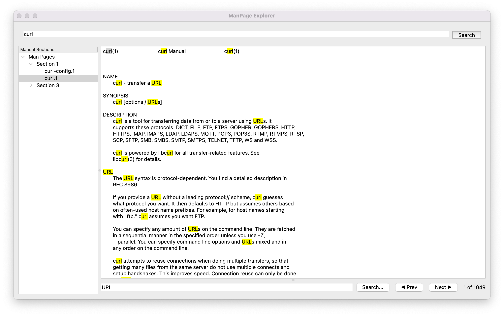

# ManPage Explorer

**ManPage Explorer** is a lightweight, PyQt6-powered graphical tool for browsing and searching Unix `man` pages. It provides a clean, searchable, and scrollable interface to the powerful manual system included with most Unix-like operating systems.



---

## 🚀 Features

- 📚 Tree-organized man page index by section (`1`, `2`, `3`, etc.)
- 🔍 Highlight-based search within the currently viewed man page
- ▶️ Navigate search matches with "Next" / "Prev" buttons
- 🎯 `Ctrl+F` shortcut to jump to the highlight search bar
- 🧠 Smart result counting (e.g. `3 of 9 matches`)
- ✨ Resizable, split-pane layout using `QSplitter`
- ⚡️ Fast startup, no external dependencies besides PyQt6

---

## 📦 Requirements

- Python 3.8+
- `man` installed (standard on most Unix-like systems)
- `col` command (part of `util-linux` or equivalent)
- PyQt6

### Install with pip:

```bash
pip install PyQt6
```

#### Or install using the provided `requirements.txt`:

```bash
pip install -r requirements.txt
```

---

## 🖥️ Usage

### Run directly:

```bash
python manpage-explorer.py
```

### Install system-wide (CLI and desktop shortcut):

Use the `setup.sh` script to install the app globally:

```bash
chmod +x setup.sh
./setup.sh --install
```

Then you can launch it using:

```bash
manpage-explorer
```

> On Linux, this will also install a `.desktop` file so it shows up in the application menu.
> On macOS, it symlinks the script to `/usr/local/bin` and recommends creating a `.app` using Automator.

To uninstall:

```bash
./setup.sh --uninstall
```

---

## ⌨️ Keyboard Shortcuts

| Shortcut | Action                          |
|----------|----------------------------------|
| Ctrl+F   | Focus the highlight search bar  |
| Enter    | Trigger highlight search        |
| F3       | (Optional: Next match)          |

---

## 📁 File Structure

```
ManPage-Explorer/
├── manpage-explorer.py        # Main application
├── setup.sh                   # Installer/uninstaller script
├── requirements.txt           # PyQt6 requirement
├── README.md                  # This file
├── docs/
│   └── ManPage-Explorer.png   # UI screenshot
```

---

## 🧪 Tested On

- macOS Monterey (Terminal.app + zsh)

---

## 📄 License

This project is licensed under the MIT License. See [LICENSE](./LICENSE) for details.

---

## 🙌 Credits

Created with 💻 by **[Sean Lum](https://github.com/seanlum)** in 2025.

GUI structure and search implementation refined with help from ChatGPT.